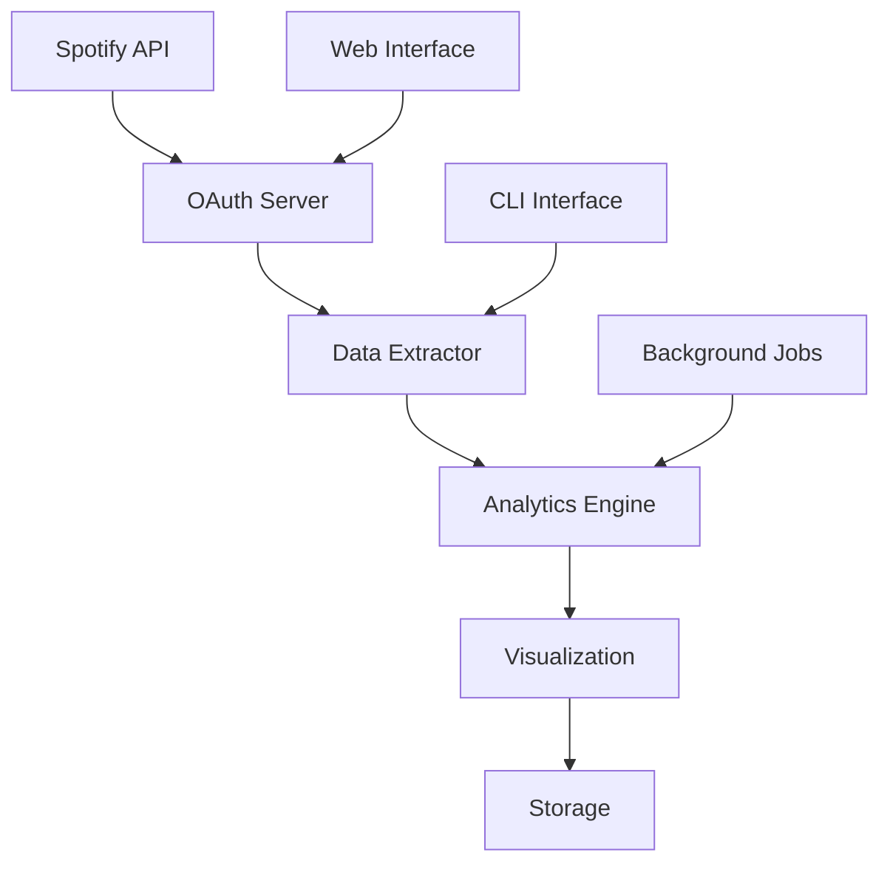

# Spotify Soul Extractor

### Music Analytics & Data Analysis Platform

[](https://python.org)
[](https://developer.spotify.com)
[](LICENSE)

*Analyze your music listening patterns with Spotify data*

---

## Overview

a Python web app that connects to your spotify account to analyze your listening history and provide insights into your music preferences and habits. basically shows you what your music taste really looks like

### Features

- Music Data Extraction: Pull your top tracks, artists, and listening history
- Analytics Dashboard: Visual charts and statistics  
- Secure OAuth: Proper Spotify authentication flow
- Docker Ready: Easy deployment with containers
- Privacy Focused: Your data stays on your machine

---

## Quick Start

```bash
# Configure Spotify API (no pip needed!)
cp .env.example .env
# Edit .env with your Spotify credentials

# Run with built-in Python server
python3 server.py
```

Visit `http://localhost:8889` to start the authentication flow.

./soulpull --ritual


---

## Analytics

### Musical Personality Analysis

The soul extractor generates insights into your musical personality:

<table>
<tr>
<td width="25%"><strong>Mood Profile</strong></td>
<td width="75%">Analyzes valence, energy, and danceability to determine your musical mood preferences</td>
</tr>
<tr>
<td width="25%"><strong>Genre Diversity</strong></td>
<td width="75%">Calculates how diverse your musical taste is across different genres</td>
</tr>
<tr>
<td width="25%"><strong>Listening Patterns</strong></td>
<td width="75%">Identifies when and how you listen to music throughout the day</td>
</tr>
<tr>
<td width="25%"><strong>Artist Loyalty</strong></td>
<td width="75%">Measures your loyalty to specific artists and discovers new vs. familiar music balance</td>
</tr>
</table>

```json
{
  "musical_personality": {
    "dominant_mood": "Energetic & Happy",
    "genre_diversity_score": 0.87,
    "discovery_rate": "High",
    "listening_consistency": "Night Owl"
  },
  "top_insights": [
    "Your music taste is 87% more diverse than average",
    "You're most active listening at 23:00-01:00",
    "Your mood tends to be upbeat and energetic",
    "You discover new artists 3x more than average"
  ]
}
```

---

## Deployment

### Render.com (Recommended)

<details>
<summary>📋 Step-by-step Render deployment</summary>

1. **Prepare your repository:**
   ```bash
   # Ensure all files are committed
   git add .
   git commit -m "Prepare for deployment"
   git push origin main
   ``Choose "Web Service"`

2. **Create Render Web Service:**
   - Connect your GitHub repository
   - Choose "Web Service"
   - Build Command: `echo "No dependencies needed"`
   - Start Command: `python3 server.py`

3. **Configure Environment Variables:**
   ```env
   SPOTIPY_CLIENT_ID=your_client_id
   SPOTIPY_CLIENT_SECRET=your_client_secret
   SPOTIPY_REDIRECT_URI=https://your-app.onrender.com/callback
   FLASK_SECRET_KEY=your_secret_key
   FLASK_ENV=production
   ```

4. **Update Spotify Redirect URI:**
   - Add your Render URL to Spotify app settings
   - Format: `https://your-app-name.onrender.com/callback`
   - ⚠️ **Important**: Replace `your-app-name` with your actual Render service name

5. **now for the scary part**
soulpull --ritual  

</details>

### Docker Deployment

```bash
# Build the image
docker build -t spotify-soul-extractor .

# Run locally
docker run -p 8889:8889 --env-file .env spotify-soul-extractor

# Deploy to cloud
docker tag spotify-soul-extractor your-registry/spotify-soul-extractor
docker push your-registry/spotify-soul-extractor
```

### Other Platforms

<details>
<summary>🚀 Additional deployment options</summary>

**Heroku:**
```bash
heroku create your-app-name
heroku config:set SPOTIPY_CLIENT_ID=your_id
heroku config:set SPOTIPY_CLIENT_SECRET=your_secret
heroku config:set SPOTIPY_REDIRECT_URI=https://your-app.herokuapp.com/callback
git push heroku main
```

**Railway:**
```bash
railway login
railway new
railway add
railway deploy
```

**Vercel:**
```bash
vercel --prod
```

</details>

---

## Architecture

<div align="center">



</div>

### Project Structure

```
spotify-soul-extractor/
├── Core Application
│   ├── server.py                 # OAuth server & web interface
│   ├── soulpull.py              # Advanced extraction engine
│   └── spotify_soul_extraction_base.py  # Base extraction class
├── Data & Analytics
│   ├── data/                    # Raw and processed data
│   ├── analytics/               # Analysis results
│   └── final_landing/           # Final reports
├── Configuration
│   ├── requirements.txt         # Python dependencies
│   ├── .env.example            # Environment template
│   └── Dockerfile              # Container configuration
├── Frontend (Optional)
│   ├── templates/              # HTML templates
│   └── static/                 # CSS, JS, images
└── Documentation
    ├── README.md               # This file
    ├── CONTRIBUTING.md         # Contribution guidelines
    └── LICENSE                 # Portfolio Showcase License
```

---

## Development

### Running Tests

```bash
# Install development dependencies
pip install -r requirements-dev.txt

# Run all tests
pytest

# Run with coverage
pytest --cov=. --cov-report=html

# Run specific test categories
pytest tests/test_extraction.py -v
pytest tests/test_analytics.py -v
```

### Code Quality

```bash
# Format code
black .

# Check linting
flake8 .

# Type checking
mypy .

# Security audit
safety check
```

### Contributing

We welcome contributions! Please see our [Contributing Guide](CONTRIBUTING.md) for details.

```bash
# Fork the repository
# Create a feature branch
git checkout -b feature/amazing-feature

# Make your changes
# Add tests for new functionality
# Ensure all tests pass

# Commit with conventional commits
git commit -m "feat: add amazing new feature"

# Push and create a Pull Request
git push origin feature/amazing-feature
```

---

## API Reference

<details>
<summary>🔗 REST API Endpoints</summary>

### Authentication
- `GET /` - Main interface
- `GET /get-auth-url` - Generate OAuth URL
- `GET /callback` - Handle OAuth callback

### Data & Analytics
- `GET /health` - Health check
- `GET /stats` - Server statistics
- `POST /extract` - Trigger data extraction
- `GET /analytics` - Get analytics results

### Example Usage
```bash
# Get server health
curl http://localhost:8889/health

# Get statistics
curl http://localhost:8889/stats | jq .

# Trigger extraction (requires auth)
curl -X POST http://localhost:8889/extract \
  -H "Authorization: Bearer YOUR_TOKEN"
```

</details>

---

## Community

### Support & Discussion

- **Bug Reports**: [GitHub Issues](https://github.com/yourusername/spotify-soul-extractor/issues)
- **Feature Requests**: [GitHub Discussions](https://github.com/yourusername/spotify-soul-extractor/discussions)
- 📧 **Email**: support@yourdomain.com
- **Discord**: [Join our community](https://discord.gg/yourserver)

### Showcase

Share your musical soul insights! Tag us with `#SpotifySoulExtractor`

---

## 📄 License

This project is licensed under a Portfolio Showcase License - see the [LICENSE](LICENSE) file for details.

**Note**: This code is provided for portfolio demonstration and educational viewing only. Commercial use, redistribution, or derivative works are not permitted without explicit written permission.

---

## Acknowledgments

- Spotify for their Web API
- Python community for excellent libraries
- Open source contributors

---

Built for music data analysis and portfolio demonstration.
- **Personalized Soul Extraction Reports** - Creative data storytelling
- **Interactive Analytics Dashboard** - Real-time Spotify insights
- **Automated Report Generation** - Custom psychological profiling

View sample: [Cricket_Round3](client_product/Cricket_Round3)